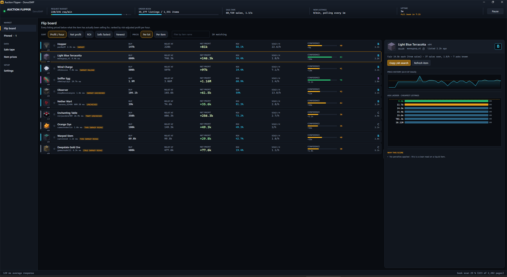
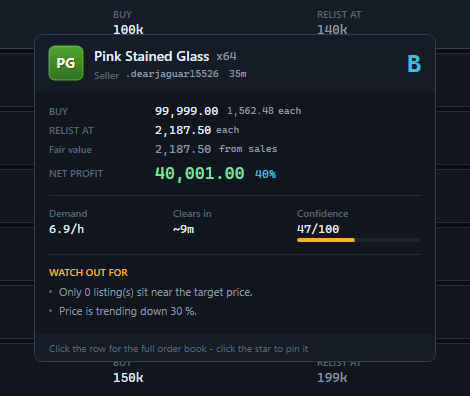
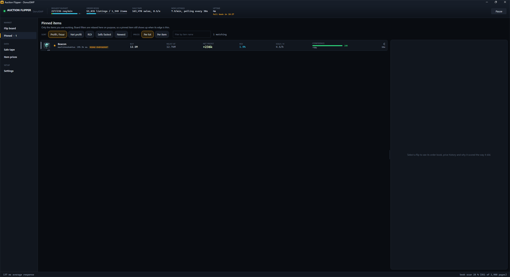
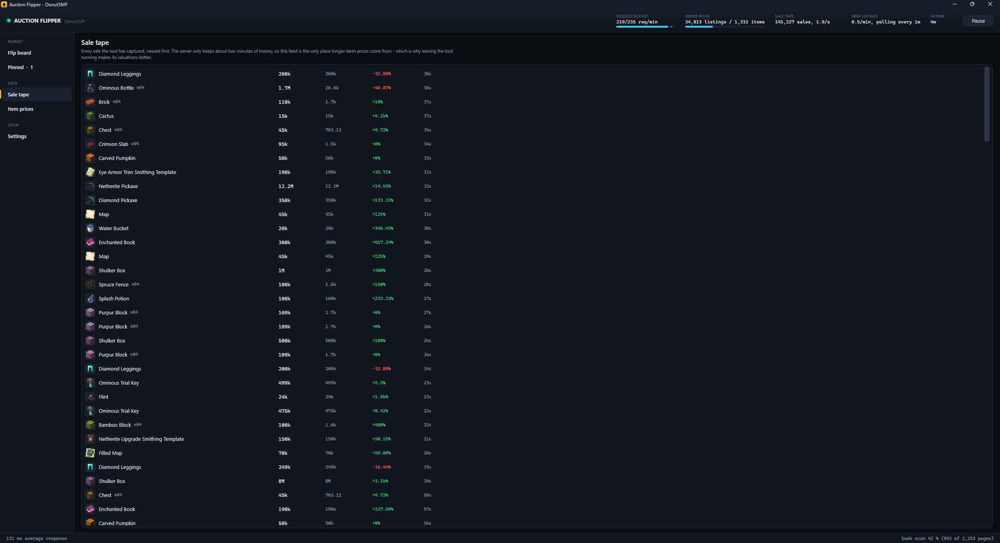
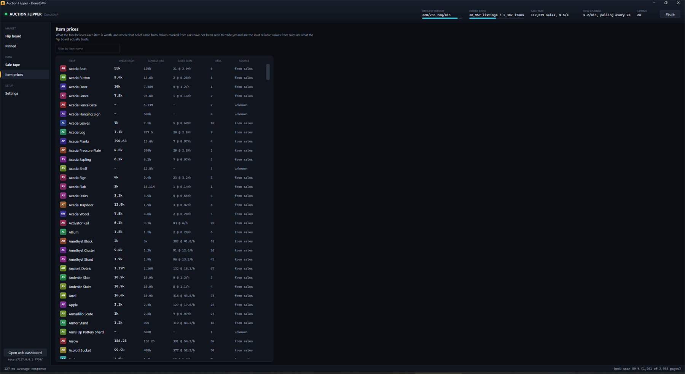
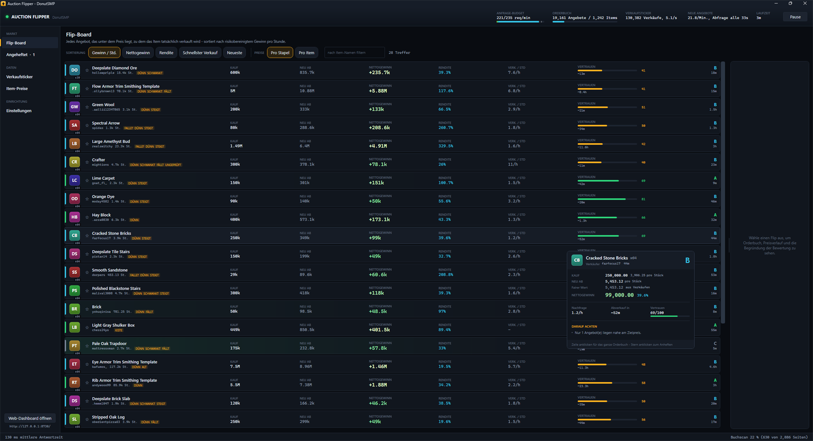

# Auction Flipper

A desktop tool that tracks the DonutSMP auction house and tells you which listings are worth buying
and reselling, by working out what items actually trade for and comparing that with what they are
being offered at.

It is read-only. It finds and ranks opportunities; you buy and list in game.



---

## What it looks like

| | |
|---|---|
|  | **Hover card** — exact coins, where the price came from, how long the stack takes to clear, and every reason the confidence was marked down. |
|  | **Pinned** — the items you are working, with the board filters relaxed and alerts that ignore the grade threshold. |
|  | **Sale tape** — every sale the tool has captured, each one measured against its own fair value. |
|  | **Item prices** — what each item is believed to be worth, and whether that came from observed sales or only from asks. |
|  | **German** — the whole interface, switched live from Settings. Item names stay in English because that is what `/ah` wants. |

---

## Quick start

Run `release/AuctionFlipper.exe`. It is a single self-contained file — no .NET install, no
dependencies, nothing to unpack. The binary is not committed (it is 60 MB of mostly .NET runtime);
build it with the publish command below, or take it from a release.

To run from source instead:

```
dotnet run --project src/AuctionFlipper
```

On first launch it opens on **Settings**. Generate a key in game with `/api`, paste it in, and press
**Save settings**. Settings, pins, the window's size and position and the screen you were last on
are written to disk within seconds of changing, not at shutdown — a crash or a killed process
loses nothing. The key is stored in `%APPDATA%\AuctionFlipper\config.json` and never leaves your
machine except in requests to `api.donutsmp.net`.

Give it a few minutes. The tool is far better at its job after half an hour than after thirty
seconds, for a reason worth understanding — see *Why it improves as it runs*.

Building from source requires the .NET 10 SDK on Windows. There are no NuGet packages; everything
is written from scratch against the in-box framework, so there is no restore step that can fail.

To rebuild the single-file release:

```
dotnet publish src/AuctionFlipper -c Release -r win-x64 --self-contained true ^
  -p:PublishSingleFile=true -p:IncludeNativeLibrariesForSelfExtract=true ^
  -p:EnableCompressionInSingleFile=true -p:DebugType=none -o release
```

---

## What it actually does

A flip is buying a listing below what the item really sells for and relisting it. The hard part is
not the arithmetic, it is knowing what "really sells for" means and not being fooled by listings
that only look cheap.

The tool runs three collectors against one shared request budget:

| Collector | Budget | What it does |
|---|---|---|
| **Sale tape** | ~12 req/min | Reads the transaction feed and records every completed sale, permanently |
| **New listings** | ~30 req/min | Watches the head of the listing feed for anything not seen before |
| **Book scan** | whatever is left | Walks the standing order book so old listings are not invisible |

The API allows 250 requests a minute, and how they are divided follows from something the API does
that is worth knowing before you trust any tool built on it — see the next section.

The order book is then maintained locally rather than re-read: new listings arrive from the watcher
and the scan, sold listings are removed the moment they appear on the tape, and anything untouched
expires on the server's 24-hour clock.

## The listing feed is not live; the sale feed is

These two endpoints behave completely differently, and the difference shapes everything:

- **`/auction/transactions` is live.** The newest sale it returns is typically under a second old,
  and roughly six sales a second stream through it.
- **`/auction/list` is a snapshot rebuilt in bulk.** Polling `recently_listed` twice a second
  returns a byte-identical page. Watched for six minutes it barely moves — one or two rows out of
  forty-four — and then every page turns over at once. The rebuild lands roughly **every five
  minutes**, and the newest row in a fresh snapshot already has several minutes on it.

This was measured, not assumed, and it corrected an earlier design here that polled the listing feed
twice a second on the assumption it was live. It was spending half the request budget to be handed
the same forty-four rows again, and the collector's own counter showed it: about one new listing a
second captured out of a market listing far faster than that.

Two consequences worth being straight about:

1. **This is not a sub-second sniping tool, because the API does not permit one.** Anything visible
   here has been on the real auction house for minutes, so the most obvious mispricings are often
   already gone. What survives is what nobody else has priced.
2. **The edge is valuation, not speed.** The live sale tape lets the tool say what an item actually
   trades for — something no player can work out in game, and something the listing feed's own
   delay does not affect. Underpriced listings that persist do so precisely because nobody knows
   what the item is worth.

The listing watcher therefore tunes itself on observed change rather than a fixed rate: polls that
find something pull the interval in, polls that find nothing push it out, up to two minutes. That
catches each rebuild shortly after it lands without spending requests in between, and the budget it
frees goes to the book scan, which is where the unseen listings actually are.

The same behaviour is why listings are dropped when they stop appearing. Nothing announces a
cancelled or externally-bought listing, so one that has gone unseen for ninety minutes — far longer
than a full pass of the book scan — is presumed gone rather than left on the board as a flip you
could not actually buy.

---

## Why it improves as it runs

The API serves only the last ~1,000 sales — about **two minutes** of market at observed rates.
That is the single most important fact about this tool.

It means real price history does not exist anywhere you can fetch it. It exists only because
something was running and writing it down. The tape is recorded to
`%APPDATA%\AuctionFlipper\sales-YYYYMMDD.log` and reloaded at startup, so the second session begins
with a day of real prices behind it instead of nothing.

Until an item has been seen to trade, the tool says so rather than guessing: values inferred from
the ask ladder are labelled *from asks* and scored down hard.

The standing book is kept too. What is currently for sale is written to
`%APPDATA%\AuctionFlipper\book.snap` every five minutes and at shutdown, and read back at the next
launch, so the board has prices from the first second instead of after a quarter of an hour of
scanning — and the scan budget goes to re-verifying rather than rediscovering. Restored listings
are treated as the claims they are: anything whose 24 h expiry has passed is dropped, a save older
than six hours is ignored outright, and what does load is badged `UNCHECKED` and scored down until a
collector sees it live again. Turn it off under Settings → Storage if you would rather always
start cold.

---

## Reading the board

Each row is one listing, ranked by default on **risk-adjusted profit per hour**. That ranking is
deliberate: the server caps you at 25 active listings, so a listing slot — not capital — is usually
the thing in short supply, and a 200k profit that clears in ten minutes beats a 400k profit that
sits for two days.

- **Grade spine** — the coloured bar on the left. S is exceptional, C is marginal. A grade needs
  profit, margin *and* confidence at once; a huge margin on an item nothing is known about is a C.
- **Net profit** — after tax, after undercutting the next ask. Brighter means bigger.
- **Sold / h** — how fast the item is actually trading, measured from the sale tape. A wide margin
  on something that sells twice a day is a listing slot tied up, not a profit.
- **Confidence** — how much the estimate should be trusted, and the most useful column on the
  board. Select a row and the detail panel lists every reason it was marked down, in plain English.
- **Badges** — `THIN` (little support at the resale price), `STALE` (has sat unsold for hours),
  `TRAP?` (discounted so far it is probably not what its id says), `1 SELLER` (one account is
  setting this price, not the market), `UNCHECKED` (restored from the last session and not yet seen
  live — it may already have been bought). Badges are translated along with the rest of the
  interface.
- **Age** — how long ago it was listed, from the server's own countdown, so it is accurate even
  though the feed is delayed. Rows glow for their first ten minutes.

**Per lot / Per item** switches the three money columns between what the whole listing costs and
what one item in it costs. Per lot is the default because that is the transaction — the auction
house sells a stack of 64 as one indivisible purchase. Per item is for comparing lots of different
sizes, where the same block offered as 64 and as 16 is otherwise four numbers apart for no reason.
Whichever way round it is, the other figure stays on the sub-line, and ROI is a ratio so it does
not change.

**Hovering a row** opens a card with everything the row had to leave out: exact coins rather than
three significant digits, what the item is worth and whether that came from sales or from asks, how
long the stack takes to clear, and every reason the confidence was marked down. It is there so a
flip can be judged without clicking into it and losing your place in a list that reorders four
times a second.

**The star** pins an item. Pinned items get their own tab, where the board filters are deliberately
relaxed — a thin edge on something you are already holding is exactly what those filters exist to
hide from the main feed — and they alert regardless of the grade and profit thresholds. Pins are
per item, not per listing, so a pin survives the listing being bought.

The detail panel shows the ask ladder, 24 hours of sale prices against the fair value line, and
**Copy /ah search**, which puts the item name on the clipboard ready to paste in game. Drag the
handle on its left edge to resize it; the width is remembered between runs.

---

## What the API cannot tell you

Worth knowing before trusting any number:

- **Enchantments, lore and custom names are never returned.** Every listing comes back with them
  empty. Two listings of `minecraft:diamond_sword` are indistinguishable through this API, and one
  may be plain while the other is worth a hundred times the asking price.

  Anything that can carry hidden enchantments is therefore dropped outright rather than ranked.
  It had its own tab in 1.0; that was a mistake. There is no analysis to perform on a coin flip,
  and a tab full of them looked like the rest of the board.

- **Container contents *are* returned**, which is the one place the API is generous. About one
  listing in ten is a shulker box or bundle, and sellers routinely price them as "a shulker" rather
  than adding up what is inside. Those are valued from their contents — counting only items with
  real observed sale history, and treating anything it cannot price as worthless — and ranked on
  the board alongside everything else. They had a separate tab until 1.2; splitting them off only
  meant a box worth flipping was on the screen you were not looking at. Settings can take them off
  the board entirely.

- **Search is a fuzzy name match, not an item id.** Searching `minecraft:diamond` returns diamond
  spears and boots and no diamonds at all, so search results are always filtered back down locally.

- **There is no `/orders` endpoint**, so buy-order arbitrage is not something this tool can see.

- **Listing data lags reality by minutes.** See the section above; it is the most important
  limitation here.

---

## Settings worth changing

- **Capital** — flips above it are badged `OVER BUDGET` rather than hidden.
- **Minimum confidence** — the most effective filter. Raise it to see only flips priced from
  observed sales.
- **Sale tax** — currently 0%, because DonutSMP takes nothing when a listing sells. If that
  changes, correct it here and all profit figures follow.
- **Alerts** — sound, desktop popup and clipboard auto-copy, each independently switchable, with a
  grade threshold and a per-item cooldown so one busy item cannot spam you. Pinned items bypass the
  grade and profit thresholds but not the cooldown.
- **Language** — English or German, switched live. Item names stay in English deliberately: they are
  what you have to type after `/ah` in game.
- **Remember the order book between runs** — on by default. Off means every launch starts cold and
  waits for the scan.

---

## Web dashboard

The same board is served read-only at `http://127.0.0.1:8730/`, streamed over server-sent events —
useful on a second monitor while the game has the foreground. It binds to loopback only and the API
key is never sent to the page.

---

## Checking it works

```
dotnet run --project src/AuctionFlipper -- --logictest   # offline, no requests
dotnet run --project src/AuctionFlipper -- --selftest    # the above, then <10 live requests
```

`--logictest` covers the parts where being wrong costs money: that the limiter never exceeds its
window, that a trillion-coin troll listing cannot become an item's valuation, and that an
implausible discount is flagged rather than celebrated. It also checks the two language tables
agree key for key and placeholder for placeholder, since a mismatched `{0}` throws at the moment
the string is shown rather than at build time; that the board's badges really do change language,
which a table check cannot see; that a settings file round-trips with its pins, its language and
its window rectangle intact; and that a saved book comes back without the listings that have since
expired, with the rest marked unverified.

`--selftest` additionally proves the live API still behaves as assumed — including that it accepts a
JSON body on a GET request, which is the only way it accepts sort and search, and which everything
here depends on.

---

## Layout

```
src/AuctionFlipper/
  Api/        HTTP client, sliding-window rate limiter, wire models
  Core/       order book, sale tape, valuation, flip scoring, container pricing
  Services/   the three collectors, persistence, alerts, dashboard server
  Ui/         WPF board, views, custom-drawn charts and gauges
  Web/        the dashboard page, embedded in the executable
  Localization.cs   the English and German string tables
```

---

## Changelog

### 1.3

- **Warm start.** The standing book is saved every five minutes and read back at launch, so the
  board is useful from the first second instead of after a quarter of an hour of scanning. Restored
  listings are badged `UNCHECKED` until seen live, dropped once expired, and ignored entirely if the
  save is more than six hours old.
- **Fixed: settings could be lost.** Everything except pins reached disk only when the window closed
  cleanly, and two running copies shared one file, so the second one to close overwrote the first.
  Settings now save themselves seconds after they change, and a second copy refuses to start —
  two copies also quietly spent twice the request budget on one key.
- Window size, position and maximised state are remembered, and the app reopens on the screen you
  left it on.
- The Pinned tab carries its count, so pins are visible straight after a restart even before any of
  those items has a live flip.
- The row badges (`THIN`, `SWINGY`, `RISING`, `FALLING`, `TRAP?` …), the item categories and the
  container contents note are translated — they were still English on a German board.

### 1.2

- Hover card on every board row: exact figures, where the price came from, and every confidence
  penalty in plain words.
- Pin items with the star. Pinned items get their own tab with relaxed filters, and alert regardless
  of the grade and profit thresholds.
- German, switched live from Settings.
- The board row is proportional at every column, so rows fill the window instead of stranding a
  quarter of each one empty on a wide monitor, and still line up figure for figure.
- The title bar follows the app's own theme instead of the Windows light one.
- **Fixed:** the sale tape and item catalogue were not virtualising — every one of their rows was
  built, then rebuilt once a second, which is what made scrolling them stutter. They now virtualise,
  update in place instead of clearing, and hold their scroll position while you read.
- The Containers tab is gone; container flips are ranked on the board with everything else.

### 1.1

- Sold / h on the board, resizable detail panel, per-lot and per-item prices, Gear tab removed.
